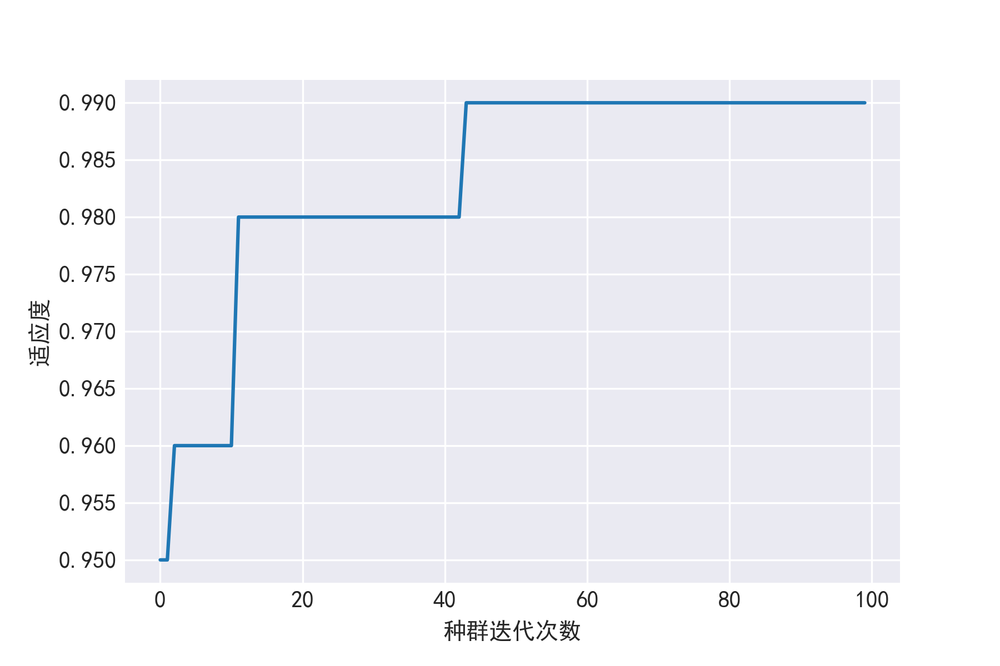

[英文](README.md)


# NGA: neural-genetic-algorithm
该算法实现了遗传算法对神经网络的优化，我们用鸢尾花数据集对该算法进行了测试，并和其他一些算法比如K近邻、逻辑回归和支持向量机作了简单比较，具体做法是：首先把数据集随机打乱并用其中的三分之二用于训练，三分之一用于测试，并对每个算法执行10次，最后统计出每个算法的平均准确率，实验结果如下：

| 算法  | 平均准确率 |
| :--- | ---: |
| K近邻| 96.8%|
| 逻辑回归|  96.8%|
| 支持向量机| 96.2%|
| NGA|  97.8%|

实际上，尽管上述实验条件相同，但实验结果仍没有说服力，因为每个算法的参数都不相同，有的模型虽然准确率偏低，但也可能是参数设置问题，所以上述结果仅作参考，下面将对NGA的参数和方法进行介绍。

## 开始

NGA算法包含在开源机器学习库mlgorithms中，所以如果您对此感兴趣或者想基于此进行开发或测试，那就先安装一下吧。 

### 安装

#### 方式 1
把mlgorithms这个repo克隆到您的计算机，然后在命令行里进入到该文件夹，直接用pip进行安装：

```
pip install .
```

#### 方式 2

我们也把该库发布到 [PyPI](https://pypi.org/project/mlgorithms/), 并且您可以通过下面这条指令随时随地安装：

```
pip install mlgorithms
```


## 测试

如果您安装成功，那么可运行下面这段代码进行测试：

```python
from mlgorithms.neural_genetic import NGA
from sklearn.datasets import load_iris

iris = load_iris()
X, y = iris.data, iris.target
in_num = X.shape[1]  # 神经网络输入层神经元个数(等于特征数目)
out_num = np.unique(y).shape[0]  # 神经网络输出层神经元个数(等于类别数目)
inst = NGA.NeuralGeneticAlgorithm(in_nodes_num=in_num, out_nodes_num=out_num)  # 这两个为必须参数
inst.model_fit(X=X, y=y)
inst.fitness_plot()  # 对每代最大适应度进行绘图
predict_label1 = inst.model_predict(X=X, model=None)  # 在拟合后直接进行预测

#当然您也可以先把模型保存，然后加载，再进行预测
inst.model_save("./model/test.model")
model = inst.model_load("./model/test.model")
predict_label2 = inst.model_predict(X=X, model=model)
```


## API 参考文档

```
class mlgorithms.neural_genetic.NeuralGeneticAlgorithm(pop_size=20, 
                                                       gen_iter_num=100, 
						       p_crossover=0.8, 
						       p_mutation=0.05,
						       in_nodes_num=None,
						       hidden_nodes_num=10,
						       out_nodes_num=None,
						       learning_rate=0.01,
						       bias=True,
						       activation_func="sigmoid",
						       ann_iter_num=1000)
```

## 参数

| 名称  | 类型 |必须?| 默认 | 说明 |
| :--- | --- | --- |---- | ---: |
| pop_size| int| 否|20|遗传算法的种群大小 |
| gen_iter_num|  int| 否| 100|遗传算法迭代次数|
| p_crossover|  float| 否| 0.8|遗传算法交叉概率|
| p_mutation|  float| 否| 0.05|遗传算法变异概率|
| in_nodes_num|  int| 是| None|神经网络输入层神经元个数(等于特征数目)|
| hidden_nodes_num|  int| 否| 10|神经网络隐藏层神经元个数|
| out_nodes_num|  int| 是| None|神经网络输出层神经元个数(等于类别数目)|
| learning_rate|  float| 否| 0.01|学习率，其实就是步长，用于更新权重|
| bias|  bool| 否| True|偏置单元|
| activation_func|  string| 否| "sigmoid"|隐藏层和输出层的激活函数|
| ann_iter_num|  int| 否| 1000|神经网络迭代次数|


## 方法

* **model_fit(self, X, y)**  

          X: 特征数据，ndarray 或 list, shape=(n_samples, n_features)  
	  y: 标签, ndarray 或 list, shape=(n_samples,)
	
	  Returns: None
	
* **model_predict(self, X, model)**  

          X: ndarray 或 list, shape=(n_samples, n_features)
	  model: 可以是加载的模型或者None，当为空时表示在模型拟合后直接进行预测。
	
	  Returns:
	      y: ndarray, shape=(n_samples,)
	         预测的类别。
	
* **model_save(self, model_path)**  

         model_path: string 或 None
	    当为string时需包含模型名字，比如: model_path="./model/test.model"； 当为None时, model_path="./model/NGA_时间戳.model"
	    
	  Returns: None

* **model_load(self, model_path)**  

          model_path:** string
	      需包含模型名字，比如: model_path="./model/test.model"
	    
	  Returns:
	      model(其实就是神经网络的权重参数)
	
* **fitness_plot(self)**  

        对每代最大适应度进行绘图，如下图所示。
	
